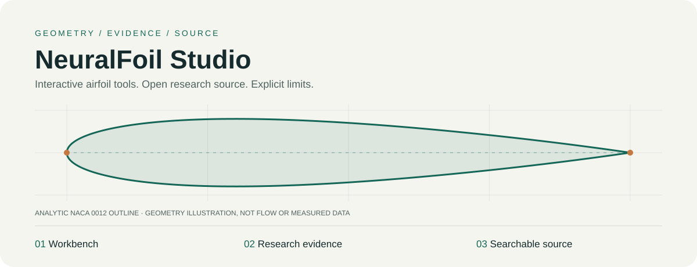

# NeuralFoil Studio



**Explore airfoils. Inspect the evidence. Read the source.**

An airfoil workbench and measurement-correction research archive by [Kaan Boge](https://github.com/KaanBoge), built on upstream [NeuralFoil](https://github.com/peterdsharpe/NeuralFoil). This is a separate project, not an official upstream version.

### Three ways in

| Workbench | Research evidence | Searchable source |
|---|---|---|
| Explore the existing browser predictions and model disagreement. | Understand the correction studies, observed gains and adverse cases. | Filter published code by collection, language and topic. |
| **[Open Studio →](https://kaanboge.github.io/neuralfoil/)** | **[Read the evidence →](https://kaanboge.github.io/neuralfoil/research.html#evidence)** | **[Explore source →](https://kaanboge.github.io/neuralfoil/research.html#source)** |

[Download public source](https://github.com/KaanBoge/neuralfoil/archive/refs/heads/main.zip) · [Source guide](code/README.md) · [MIT license](LICENSE) · [License scope](LICENSING.md)

> **Two implementations, not one accuracy claim.** The browser’s NeuralFoil B wrapper retains its legacy lift correction within its specified operating limits; **drag correction is disabled**. Newer Python drag-correction procedures are archived research, **not installed in the browser**. Model disagreement is not a calibrated error guarantee.

## What is here

The browser combines eight unchanged upstream NeuralFoil 0.3.3 networks with the existing interface and empirical diagnostics. The research archive studies a separate shared drag correction using geometry, operating conditions and NeuralFoil-derived features, leaving the neural-network weights unchanged. It starts from the mean of eight model sizes; xlarge is a separate comparison baseline.

The established learned-strength reference reduced historical drag MAE by **20.47% and 19.69% relative to xlarge**, on two grouped assignments of the **same 8,371 observations and 93 conservative identities**. Some rows, identities and external cases worsened. The collections were adaptively reused: these are not independent experimental replications or universal accuracy gains.

The archive includes half-strength controls, interval projection, added-loss calibration and conservative tree bounds—not only successful experiments. A tighter bound is not an equal percentage improvement in prediction. Trees and abrupt threshold-based switching do not preserve global differentiability. See [methods](docs/METHODS.md), [status and known harms](docs/STATUS.md), and [data requirements](docs/DATA.md).

**Release boundary:** reviewed source, technical documentation and synthetic examples are public. The current manuscript, its figures, private reproduction packages and new measurement/model payloads are not included. Existing site assets and older study material retain their own histories and terms. Source availability is not a flight-safety certificate or one-command reproduction of the private study.

## Open locally

With Python 3 installed, run from the repository root:

```sh
python3 -m http.server 8000 --bind 127.0.0.1
```

Open [the workbench](http://localhost:8000) or [the source explorer](http://localhost:8000/research.html). HTTP enables relative data fetches. This serves the existing website; it does not run Python research experiments. The static explorer needs no build step or external JavaScript dependencies.

## Go deeper

<details>
<summary><strong>Browse collections and research topics</strong></summary>

| Collection | Contents | Folder |
|---|---|---|
| [Research archive](https://kaanboge.github.io/neuralfoil/research.html?collection=research#source) | Correction models, transfer experiments, calibration and numerical bounds | [code/research](code/research) |
| [Source supplement](https://kaanboge.github.io/neuralfoil/research.html?collection=supplement#source) | Historical helpers, generic report builders and execution utilities | [code/supplement](code/supplement) |
| [Browser application](https://kaanboge.github.io/neuralfoil/research.html?collection=browser#source) | Studio, browser wrapper and research explorer | [index.html](index.html) · [nfb.js](nfb.js) |
| [Public checks and examples](https://kaanboge.github.io/neuralfoil/research.html?collection=checks#source) | Synthetic interfaces and source-integrity tools | [tests](tests) · [tools](tools) · [examples](examples) |
| [Legacy study](https://kaanboge.github.io/neuralfoil/research.html?collection=study#source) | Earlier scripts and browser-era research material | [study](study) |

**Topics:** [Portable inference](https://kaanboge.github.io/neuralfoil/research.html?collection=research&q=portable#source) · [Risk policy](https://kaanboge.github.io/neuralfoil/research.html?collection=research&q=risk+policy#source) · [Calibration](https://kaanboge.github.io/neuralfoil/research.html?collection=research&q=calibrat#source) · [Tree bounds](https://kaanboge.github.io/neuralfoil/research.html?collection=research&q=tree+bound#source) · [Python](https://kaanboge.github.io/neuralfoil/research.html?language=Python#source) · [JavaScript](https://kaanboge.github.io/neuralfoil/research.html?language=JavaScript#source)

The explorer combines collection/language/search filters, sorting, matching counts, shareable views, raw-file links, SHA-256 details and a metadata export. Categories follow file locations; inclusion is not model promotion. The [tracked-source catalog](code/source-catalog.json) measures published coverage, not ownership clearance or end-to-end reproducibility.

</details>

<details>
<summary><strong>Try a synthetic Python interface</strong></summary>

This example needs Python and NumPy, not NeuralFoil, trained correction weights or measurements. From the repository root:

```sh
python3 -m venv .venv
.venv/bin/python -m pip install numpy==2.3.5
.venv/bin/python -B examples/synthetic_policy.py
.venv/bin/python -B -m unittest discover -s tests -p test_public_smoke.py -v
```

The example and six targeted tests passed in Python 3.12.14 with NumPy 2.3.5. The artificial example returns CD `[0.0125, 0.02]`, applied strength `[0.5, 0.0]`, and the exact baseline when the eligibility flag is false. It constructs constant parameters and demonstrates an interface, **not aerodynamic accuracy or a released trained model**. Setup commands are instructions, not evidence of a fresh-install reproduction test.

With Node.js 18 or newer, the explorer’s synthetic navigation suite is:

```sh
node --test tests/test_source_browser.cjs
```

It checks catalog validation, filtering, sorting, URL state and UI behavior using a synthetic DOM harness—not aerodynamic accuracy or browser rendering.

</details>

<details>
<summary><strong>Understand the repository and reproduction boundary</strong></summary>

```text
index.html, nfb.js       Existing browser application
research.html/.css/.js   Research hub and interactive source explorer
source-browser.js       Filters, sorting and shareable URL state
assets/                 Presentation assets, including the original SVG overview
nfweights/              Existing model assets and references
study/                  Earlier website and study material
code/research/          Original reviewed research archive
code/supplement/        Source-only completeness additions
examples/, tests/       Explicitly synthetic public examples and smoke tests
tools/                  Public source-integrity utilities
docs/                   Technical guides and historical README
```

The research tree is an archive, not a ready-made Python package. Some scripts retain local paths and authenticated-input assumptions. Full reconstruction requires authorized inputs, compatible dependencies and reviewed path adapters. **Do not assume broad test discovery across archived experiments is synthetic or self-contained.**

The [source guide](code/README.md) covers completeness, utility additions, historical failures and excluded manuscript content. Regenerate the catalog from the Git index with `python -B tools/build_source_catalog.py --repo .`; after staging it, `python -B tools/verify_source_catalog.py --repo .` verifies the complete tracked-source set and hashes. This is an integrity check, not an accuracy evaluation.

For older terminology, read the [historical Studio README](docs/LEGACY_STUDIO.md). To propose a reproducible change, see [Contributing](CONTRIBUTING.md).

The overview banner is an original analytic NACA 0012 geometry illustration. Its construction lines are not simulated flow, measurements or a paper figure.

</details>

## Attribution and reuse

Original project code and new associated technical documentation are available under the **[MIT License](LICENSE)**, copyright (c) 2026 Kaan Boge. Commercial use and integration are permitted subject to its notice requirements. [License scope](LICENSING.md) and [third-party notices](THIRD_PARTY_NOTICES.md) preserve separate terms for upstream software, assets and historical material; this is not a blanket research-data license.

NeuralFoil and AeroSandbox are developed by **Peter Sharpe and contributors**. This project’s browser network assets and port derive from upstream work. NeuralFoil B is a project-specific wrapper, not an upstream release or endorsement.

[CITATION.cff](CITATION.cff) supplies software metadata; record the exact commit and procedure used. No DOI, journal acceptance, independent experimental confirmation, universal accuracy, safety or real-time-performance guarantee is claimed. Public visibility does not grant redistribution rights to measurement collections or recovered coordinates.
